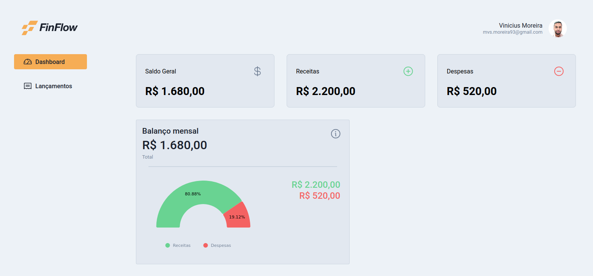
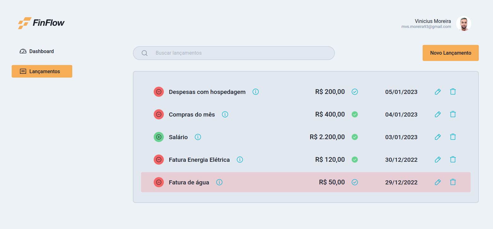
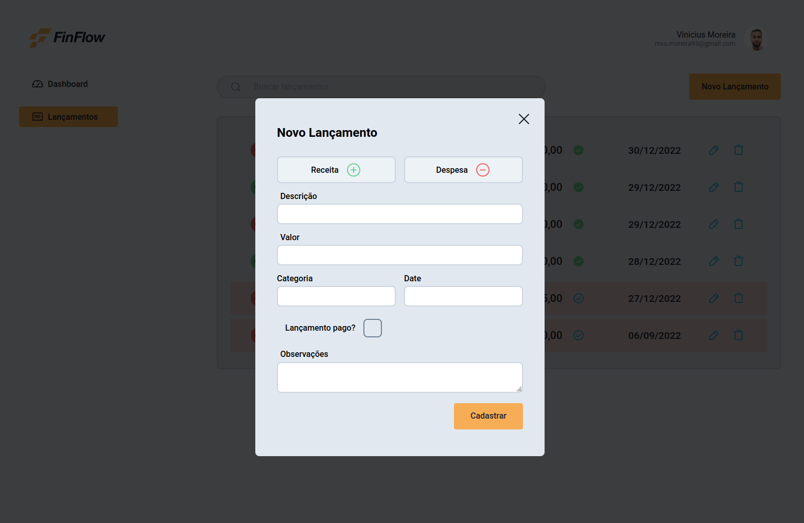

<p align="center">
    
</p>


<p align="center">Um App simples para cadastro e controle de transações financeiras!</p>
<br/>

<h2 align="center">Status</h2>
<h4 align="center"> 
	🚧  Em desenvolvimento...  🚧
</h4>
<br/>
<p align="center">
 <a href="#objetivo">Objetivo</a> •
 <a href="#features">Features</a> • 
 <a href="#demo">Demo</a> • 
 <a href="#tecnologias">Tecnologias</a> • 
 <a href="#instalação">Instalação</a> • 
 <a href="#autor">Autor</a>
</p>

## Objetivo
Esse app foi desenvolvido para estudos e prática nas [tecnologias](#tecnologias) usadas no projeto. 

---

## Features

- [x] Dashboard com resumo financeiro
- [x] Lista de transações com busca ativa
- [x] Cadastro, edição e exclusão de uma transação
- [x] Cadastro de transação futura (Ainda não efetuada)
- [x] Sistema de indicação de transação atrasada
- [ ] Cadastro de categorias
- [ ] Paginação de transações por meses
- [ ] Resumo de saldo na página de transações
- [ ] Autenticação e login com github e Google
- [ ] Suporte a contas e cartões de crédito
- [ ] Suporte a transferência entre contas cadastradas
- [ ] Filtro avançado (substitui a busca)
- [ ] Relatórios financeiros
- [ ] Modo escuro

Você pode conferir meu design completo do projeto no [Figma](https://www.figma.com/file/ABihWOzsA7CZ6kEy1p3lFb/FinFlow?node-id=0%3A1&t=zFNYaC5oBVUK00YG-1).

## Demo
O projeto está hospedado na [Vercel](https://vercel.com/). Você pode conferir a demo [aqui](https://finflow-six.vercel.app/).

### Screens

* Dashboard


* Lançamentos


* Adicionar transação


---

## Tecnologias
O App é desenvolvido com [Vite](https://vitejs.dev/) usando [ReactJs](https://reactjs.org/) e [Typescript](https://www.typescriptlang.org/). </br>
Atualmente o projeto é focado em frontend com ênfase no uso de hooks e contextos a fim de aprender melhor seus respectivos usos. Futuramente será desenvolvido um backend dedicado se tornando um app fullstack, porém no momento conta apenas com um [micro servidor](https://github.com/mvsmoreira/finflow-server) para simular seu comportamento com o [JSON Server](https://www.npmjs.com/package/json-server).

### Libs
As demais bibliotecas usadas no projeto são:
- [React Router](https://reactrouter.com/en/main) - Para roteamento e navegação.
- [React Hook Form](https://react-hook-form.com/) - Para criação do formulário de cadastro das transações.
- [Nivo Charts](https://nivo.rocks/) - Para os gráficos e relatórios pesonalizados 
- [Radix UI](https://www.radix-ui.com/) - Para alguns componentes genéricos como Checkboxes, Modais etc..
- [Zod](https://zod.dev/) - Para validação de dados no formulário
- [Styled Components](https://styled-components.com/) - Para estilização e CSS em geral.

---


## Instalação
Antes de começar, você vai precisar ter instalado em sua máquina as seguintes ferramentas:
[Git](https://git-scm.com), [Node.js](https://nodejs.org/en/), [Yarn](https://yarnpkg.com/).

### Rodando a aplicação

```bash
# Clone este repositório
$ git clone <https://github.com/mvsmoreira/finflow>

# Acesse a pasta do projeto no terminal/cmd
$ cd finflow

# Instale as dependências
$ yarn

# Execute a aplicação em modo de desenvolvimento
$ yarn dev

# A aplicação inciará na porta:5173 - acesse <http://localhost:5173>
```

## Autor
---
</br>
 
 <br />
 <sub><b>Vinicius Moreira</b></sub>


Desenvolvido por Vinicius Moreira 👋🏽 Entre em contato!

 [](https://www.linkedin.com/in/mvsmoreira93/) 
[](mailto:mvs.moreira93@gmail.com)